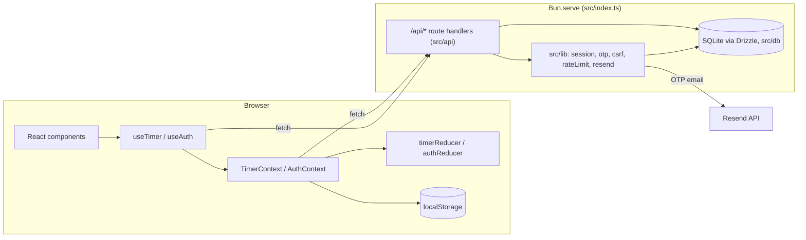

# Pokédoro — Architecture Review

> Reviewed 2026-07-27 against the codebase at commit `75ead4f`. Analysis only — no code was changed.
> Lenses used: Domain-Driven Design (DDD) and Clean Architecture, applied pragmatically to a small full-stack app.

---

## 1. What the system is

Pokédoro is a **full-stack Bun monolith**: a single `Bun.serve()` process (`src/index.ts`) serves both the React SPA (via Bun's HTML-import bundling of `src/index.html`) and a JSON API. Persistence is SQLite through Drizzle ORM. Auth is passwordless email OTP (Resend) with DB-backed sessions.

### Runtime topology



### Module inventory

| Area | Location | Role |
|---|---|---|
| Composition root | `src/index.ts` | Route table, body-size cap, HMR config, auth-record purge scheduler |
| HTTP handlers | `src/api/**` | Zod validation + CSRF/session checks + direct Drizzle queries |
| Server infra | `src/lib/**` | Sessions, OTP generation/hashing, CSRF origin check, in-memory rate limiter, Resend email, cleanup |
| Persistence | `src/db/**` | Drizzle schema (5 tables), client, SQL migrations |
| Client state | `src/contexts`, `src/reducers`, `src/hooks` | Context + Reducer pattern; providers own side effects |
| UI | `src/components/**` | Smart `Timer` container; presentational `TimerDisplay`/`TimerControls`; `ui/` primitives (CVA + Tailwind 4) |
| Shared-ish | `src/types`, `src/utils` | Domain types, pure helpers, localStorage adapters |

### Domain model (as implemented)

- **Timer/Pomodoro context** — `PomodoroCycle` (phase, status, three durations in seconds, deadline `sessionTimeout`, `remaining`) driven by a pure `timerReducer`; the provider runs the 1-second `TICK` interval, persists to localStorage, records completed cycles to `/api/cycles`, and syncs state to `/api/timer-state` across login/logout transitions.
- **Identity/Auth context** — email OTP request → verify → user upsert → opaque session token (only its SHA-256 stored). Client keeps a localStorage "auth flag" so it can skip the `/api/auth/me` probe when clearly logged out.

---

## 2. What is working well

These are genuine strengths worth preserving through any refactor:

1. **Pure reducers, effects in providers.** The reducer/effect split is disciplined and consistently applied — this *is* the Clean Architecture instinct (policy separated from I/O), just expressed in React idiom.
2. **Security posture is far above hobby-project baseline.** Hashed session tokens and HMAC-peppered OTP hashes (nothing recoverable from a DB dump), constant-time comparison, atomic SQL attempt-claiming to prevent race-based brute force, modulo-bias-free OTP generation, layered rate limits (per-email + per-IP), CSRF origin checks on mutations, request body cap, fail-fast on missing prod secrets, periodic purge of expired auth rows.
3. **Deadline-based timekeeping.** `remaining` is derived from a wall-clock deadline rather than counted down, so the timer survives tab sleep and page reloads correctly (`reviveTimerState` recomputes on load).
4. **Testing culture.** Colocated tests everywhere, 100% function/line coverage enforced on components/contexts/hooks, and comments in security code explaining *why* (e.g. the atomic claim in `verifyOtp.ts:47-55`).
5. **Consistent conventions.** The `<Name>/<Name>.tsx + index` barrel pattern, presentational/container split, and path alias are applied uniformly — a new feature has an obvious template to follow.

---

## 3. Findings

Ordered by architectural significance, not severity.

### 3.1 The client/server boundary exists only by convention (highest-impact issue)

`src/` mixes two programs with different trust levels and runtimes, distinguishable only by folder name:

- **Server-only:** `api/`, `db/`, `lib/` (except `reviveUser`), `index.ts`
- **Client-only:** `components/`, `contexts/`, `hooks/`, `reducers/`, `frontend.tsx`
- **Shared:** `types/`, `utils/`, `lib/reviveUser.ts`

Nothing prevents a client file from importing `@/lib/session` or `@/db/client`. `lib/reviveUser.ts` (client-side, imported by `AuthContext`) already lives next to `session.ts` (server-side, touches the DB) — the precedent for accidental cross-boundary imports is set. In Clean Architecture terms, the outermost frameworks ring (Bun server, browser DOM) has no enforced boundary between its two halves.

### 3.2 No application layer on the server — use cases live inside HTTP handlers

`verifyOtp.ts` is the clearest example: one function performs transport parsing, rate limiting, OTP lookup, atomic attempt claim, hash comparison, code consumption, **user registration**, session creation, and cookie serialization. "Sign in with OTP (registering the user if new)" is a business use case, but it exists only as the body of an HTTP handler and is coupled to `Request`/`Response`, Zod, and Drizzle simultaneously.

Consequences today: the use case can only be tested through HTTP-shaped calls, and business rules (attempt caps, auto-registration) are invisible in the file structure. This is the classic missing *interactor* layer.

### 3.3 Handlers depend directly on Drizzle — no repository/port seam

Every handler imports `db` and the table objects. There is no interface between "what the domain needs" (find active OTP for email, claim an attempt, persist a cycle) and "how SQLite does it." The in-memory rate limiter (`lib/rateLimit.ts`) has the same property: it is a concrete `Map` that silently stops being correct the moment a second server instance exists, with no interface that would let a Redis-backed implementation swap in.

At current scale this is defensible; it becomes expensive exactly when the first "we need Postgres / a second instance / a test that doesn't hit SQLite" moment arrives.

### 3.4 The timer domain model is anemic and its language has drifted

DDD's core discipline — a model with enforced invariants and a consistent ubiquitous language — is where the timer code is weakest:

- **State-machine logic is scattered.** Legal phase/status transitions live partly in `timerReducer`, partly in provider effects (auto-`RESET` on `IDLE && remaining === 0`, cycle recording, auth sync), partly in `useTimer` handlers. No single artifact states what transitions are legal.
- **`START_FOCUS` never sets `phase: 'FOCUS'`** (`timerReducer.ts:28-41`), while `START_BREAK`/`START_LONG_BREAK` do set theirs. It works today only because `RESET` happens to restore `phase: 'FOCUS'` first — an invariant maintained by accident, not by the model.
- **`calculateRemaining(sessionTimeout, focusDuration)` hard-codes the focus duration as fallback**, and `PAUSE`/`TICK` pass `state.focusDuration` even during breaks (`timerReducer.ts:75-78,138`). Correct today only because the fallback is unreachable while a deadline exists — another accidental invariant.
- **Unit ambiguity is encoded in the API:** `SET_*` action payloads reuse the `focusDuration` field name but carry **minutes**, which the reducer multiplies by 60 into the same-named **seconds** field. This is the textbook argument for a `Duration` value object (or at minimum distinct payload names like `minutes`).
- **Language drift:** `sessionTimeout` actually means *deadline/endsAt*; `resetedAt` is a typo; the `interval: Date | null` field is dead; the `DONE` phase exists in `types/pomodoro-cycle.ts` and both server Zod schemas but is never produced by the reducer; and `types/pomodoro-cycle.ts` still exports a stale second `TimerAction` type (already flagged in CLAUDE.md). Persisted state and the DB now carry these artifacts, so cleanup cost grows over time.

### 3.5 API contracts are defined twice with no shared source of truth

The shape of timer state exists independently as: the client `PomodoroCycle` type, the server Zod schema in `timerState.ts`, and the JSON blob in `timer_states.state`. Same for the cycle payload (`TimerContext.tsx:62-67` vs `cycles.ts:12-17`). Since this is a single repo sharing one `src/` tree, the drift risk is entirely self-inflicted — Zod schemas in a shared module with `z.infer<>`-derived types would make client, server, and (deserialized) storage agree by construction. This is the same finding as 3.1 viewed from the data side: `timer_states.state` being an opaque JSON string means the DB schema has no opinion about the app's most important document.

### 3.6 `TimerContextProvider` is an application service disguised as a component

`TimerContext.tsx` orchestrates four distinct responsibilities via effects: the tick interval, localStorage persistence (on every state change, i.e. every second while running), cycle completion recording, and a genuinely intricate auth-driven sync policy (login-claims-local-session vs login-restores-account-state vs logout-resets — the 15-line comment at lines 83-97 is the spec). The policy is sound and well-documented, but it is *application logic* expressed as `useEffect` dependency arrays, which is the hardest-to-test, easiest-to-break encoding available. The dependency-array subtleties (excluding `remaining` to avoid per-tick writes) are load-bearing and invisible to the type system.

Relatedly, `fetch` calls are scattered across three layers (provider effects, `useAuth`, `AuthContext`) with no client API module — and the name `src/api/` is already taken by *server* handlers, so the natural home for one is confusingly named.

### 3.7 Organization is by technical kind, not by feature

`components/ contexts/ hooks/ reducers/` slices every feature horizontally. The two bounded contexts that clearly exist — **Auth/Identity** and **Pomodoro/Timer** — are each smeared across six folders. CLAUDE.md says "more feature contexts are expected," which means this cost compounds: each new feature adds a file to every technical folder rather than one cohesive module.

### 3.8 Smaller observations

- `bodySchema` in `timerState.ts` accepts date strings up to 100 chars but never validates they parse as dates; `reviveTimerState` on the client tolerates this, so it's harmless today — but the server is trusting the client to re-validate its own data on the way back in.
- `requestOtp` returns an unhandled 500 if `sendOtpEmail` throws (Resend outage) — consider whether that should distinguish "email failed" from generic failure without enabling enumeration.
- CLAUDE.md describes only the timer-and-frontend app; the entire backend (auth, DB, API) is undocumented there, so the project's primary onboarding document no longer matches reality.
- `package.json` is still named `bun-react-template` / version 0.1.0.

---

## 4. Recommendations

Ranked by value-to-effort for a codebase this size. The theme throughout: **the code already behaves like it has layers — make the layers physical.** Deliberately *not* recommended: full hexagonal ceremony (DI containers, one-interface-per-class, CQRS). At ~90 files that would cost more than it returns.

### R1 — Make the client/server/shared boundary physical (do this first)

Restructure `src/` so the bundler and reviewers can see the boundary:

```
src/
  client/      components/ contexts/ hooks/ reducers/ frontend.tsx index.css
  server/      api/ db/ lib/ index.ts
  shared/      types/ schemas/ utils/        # importable from both sides
```

Rules: `client` never imports `server`; both may import `shared`. Move `reviveUser` to `shared`. This single move resolves finding 3.1, frees the `api` name for a future client API module, and is almost entirely a mechanical `git mv` + import-path update.

### R2 — Single source of truth for contracts (Zod in `shared/schemas`)

Move `bodySchema` definitions for cycles and timer state into `shared/schemas/`, export `z.infer<>` types, and have both the server handlers and the client types consume them. `PomodoroCycle` (client) and the timer-state wire format then cannot drift. This also gives you client-side validation of hydrated server state for free (`reviveTimerState` can `safeParse` instead of trusting shape). Resolves 3.5.

### R3 — Consolidate the timer domain and fix the drift (small, high-signal)

A focused cleanup pass on the Pomodoro model:

- Delete the stale `TimerAction` in `types/pomodoro-cycle.ts` and the dead `interval` field; rename `resetedAt` (migrating persisted state via `reviveTimerState`'s fallback behavior).
- Make `START_FOCUS` set `phase: 'FOCUS'` explicitly; make `calculateRemaining`'s fallback phase-aware (or drop the fallback and handle `null` deadline at call sites).
- Decide whether `DONE` is a real phase (reducer should be able to produce it) or remove it everywhere.
- Rename `SET_*` payloads to say `minutes`, or introduce a tiny `Duration` helper (`Duration.fromMinutes(n).seconds`) — the cheapest possible value object, targeted at the one unit bug this codebase is structurally inviting.
- Consider expressing legal transitions as one table/map (`{ IDLE: { START_FOCUS: … } }`) so the state machine is readable in a single place. The reducer stays the mechanism; the table becomes the spec.

### R4 — Extract the provider's orchestration into named hooks

Split `TimerContextProvider`'s effects into intention-revealing hooks colocated with the context: `useTickInterval(status, dispatch)`, `useLocalTimerPersistence(timer)`, `useCycleRecorder(timer, auth)`, `useAccountSync(timer, auth, dispatch)`. Behavior is unchanged; each policy becomes individually testable and the 15-line sync comment becomes the doc-comment of one hook. This is the Clean Architecture "use case" idea at React scale, without new abstractions. Add a small `client/api.ts` (or `shared`-typed fetch wrapper) so `fetch` stops appearing in four files.

### R5 — Organize by feature (bounded context), when convenient

Within `client/` (and eventually `server/`), group by context rather than kind:

```
client/features/
  timer/   Timer*, TimerContext, timerReducer, useTimer, timerStorage
  auth/    Login*, AuthContext, authReducer, useAuth, authFlag
client/ui/           # Button, Input, Label — the shared design system
```

This can ride along with R1 or come later; it mainly pays off when the promised additional feature contexts arrive.

### R6 — Introduce server seams only where change is plausible

Two narrow ports, not a full repository layer:

- **`RateLimiter` interface** wrapping the current in-memory implementation — this is the component guaranteed to change if the app ever runs more than one instance, and the current one loses state on every restart.
- **An auth service module** (`server/auth/service.ts` or similar) holding `requestOtpForEmail(email)` and `verifyOtpAndSignIn(email, code)` extracted from the handlers, taking/returning plain data. Handlers shrink to: parse → rate-limit/CSRF → call service → serialize. This captures ~80% of the use-case-layer benefit for the two genuinely complex flows, at ~10% of the ceremony. Drizzle can stay directly inside the service — a repository interface is not yet warranted.

### R7 — Update CLAUDE.md (and `package.json` identity)

Document the server side: route table, auth flow, the timer-state sync policy (lift the provider comment), env vars (`OTP_SECRET`, `RESEND_API_KEY`, `OTP_FROM_EMAIL`, `DATABASE_PATH`), and `db:generate`/`db:migrate` scripts. The stale-doc gap is currently the fastest way for a contributor (human or AI) to make a wrong assumption.

### Sequencing

R1 → R2 → R3 are a natural first wave (mostly mechanical, each unlocks the next). R4 and R7 are independent and can happen anytime. R5 and R6 are opportunistic — do them when touching those areas anyway.

---

## 5. Scorecard

| Dimension | Assessment |
|---|---|
| Separation of policy from I/O (client) | **Good** — pure reducers, effects in providers; weakened by orchestration-in-effects (3.6) |
| Separation of policy from I/O (server) | **Weak** — use cases embedded in HTTP handlers (3.2, 3.3) |
| Dependency direction | **Mostly sound**; `timerReducer` → `TimerContext` import (`initialTimerState`) points inward-to-outward and should flip |
| Boundary enforcement | **Absent** — client/server split is convention only (3.1) |
| Ubiquitous language / model integrity | **Drifting** — dead fields, phase/unit ambiguities, duplicated action types (3.4) |
| Contract integrity | **At risk** — three independent definitions of timer state (3.5) |
| Security engineering | **Strong** — notably above typical for this app size |
| Testability & test discipline | **Strong** — enforced coverage, colocated tests, effect-testing conventions |
| Documentation accuracy | **Stale** — CLAUDE.md predates the entire backend (3.8) |
